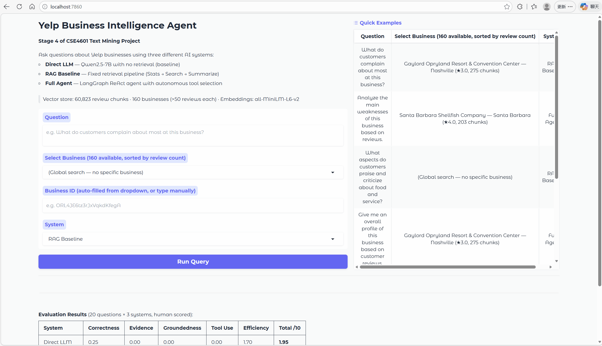
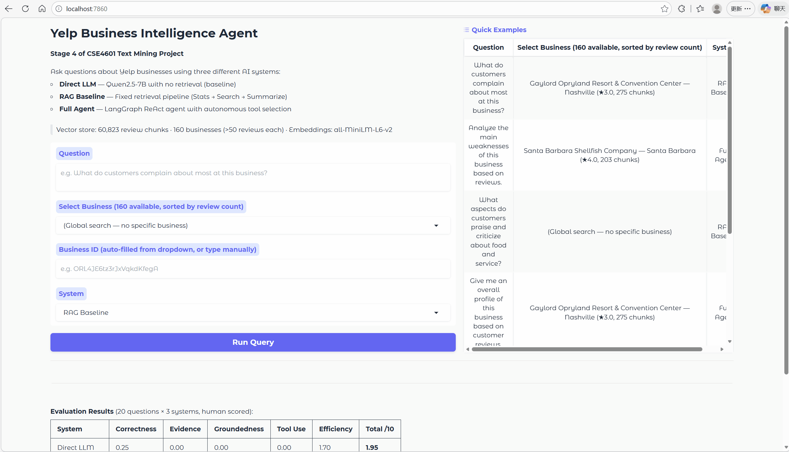

# Yelp 评论分析：Baseline 对比、BERT 微调、大语言模型评测与商业智能 Agent

本仓库包含一个多阶段的自然语言处理项目，主题是 **Yelp 评论分析**。整个项目按照逐步推进的实验流程组织：

1. **第一阶段（Stage 1）—— Baseline 对比**  
   比较传统稀疏特征、冻结句向量表示，以及 transformer baseline。
2. **第二阶段（Stage 2）—— BERT 微调**  
   系统探索不同 backbone、任务设定和超参数配置。
3. **第三阶段（Stage 3）—— 大语言模型评测**  
   在同一评论评分任务上评测指令微调的大语言模型。
4. **第四阶段（Stage 4）—— 商业智能 Agent**  
   构建生产级 RAG + LangGraph ReAct Agent，回答关于 Yelp 商家的自然语言问题，并通过三方基准测试进行评估。

整个项目的目标是观察：当方法从以下几类逐步升级时，性能与能力会如何演变：

- 特征工程方法；
- 固定的预训练语义表示；
- 端到端的 transformer 微调；
- 基于现代大语言模型的直接提示推理；
- 以及具备自主检索增强能力的 Agent 系统。

---

## 项目结构

```text
Yelp_Project/
├── .idea/
├── data/
├── s1_baseline_models/
├── s1_baseline_results/
├── s1_baseline_scripts/
│   ├── baseline_bert.ipynb
│   ├── baseline_embedding.ipynb
│   ├── baseline_tfidf.ipynb
│   ├── preprocess_and_split.ipynb
│   └── sample_data.ipynb
├── s2_bert_models/
├── s2_bert_results/
├── s2_bert_scripts/
│   ├── config.py
│   ├── data_loader.py
│   ├── run_colab.sh
│   ├── run_experiments.py
│   ├── run_local.sh
│   ├── train.py
│   └── utils.py
├── s3_LLM/
│   ├── stage3_deepseek_2class_direct_benchmark.ipynb
│   ├── stage3_deepseek_5class_direct_benchmark.ipynb
│   ├── stage3_deepseek_2class_improved_benchmark.ipynb
│   ├── stage3_deepseek_5class_improved_benchmark.ipynb
│   ├── stage3_deepseek_generate_thinking_chains.ipynb
│   ├── stage3_deepseek_2class_finetune_bf16.ipynb
│   ├── stage3_deepseek_5class_finetune_bf16.ipynb
│   ├── stage3_qwen_2class_direct_benchmark.ipynb
│   ├── stage3_qwen_5class_direct_benchmark.ipynb
│   ├── stage3_qwen_2class_finetune.ipynb
│   ├── stage3_qwen_5class_finetune.ipynb
│   ├── stage3_qwen_2class_finetune_bf16.ipynb
│   ├── stage3_qwen_5class_finetune_bf16.ipynb
│   └── 各类实验输出文件夹
└── s4_agent/
    ├── app.py
    ├── config.py
    ├── step0_train_and_save.py
    ├── artifacts/roberta_5class_best/
    ├── vectorstore/
    ├── tools/
    ├── pipelines/
    ├── evaluation/
    └── results/
```

---

## 第一阶段：Baseline 对比

第一阶段用于建立三类建模范式之间的初步对比。

### 1. TF-IDF baseline
**文件：** `s1_baseline_scripts/baseline_tfidf.ipynb`

- 文本表示：TF-IDF 特征
- 分类器：Logistic Regression
- 目的：提供一个传统稀疏特征 baseline

### 2. 冻结句向量 baseline
**文件：** `s1_baseline_scripts/baseline_embedding.ipynb`

- 文本表示：Sentence-BERT embeddings
- 分类器：Logistic Regression
- 目的：测试不进行端到端微调时，固定预训练语义表示的效果

### 3. Transformer baseline
**文件：** `s1_baseline_scripts/baseline_bert.ipynb`

- Backbone：transformer 分类模型 baseline
- 训练方式：端到端微调
- 目的：验证任务自适应的 transformer 是否优于前两个 baseline

### 辅助 notebook
- `preprocess_and_split.ipynb`：数据清洗与 train/validation/test 划分
- `sample_data.ipynb`：样本抽取或数据快速检查

### 第一阶段输出
第一阶段的结果保存在：

- `s1_baseline_models/`
- `s1_baseline_results/`

这些 baseline notebook 会同时保存 **validation** 和 **test** 的结果，包括指标、classification report、confusion matrix 以及 prediction 文件。

### 第一阶段主要结果（5分类，测试集）

| 模型 | Accuracy | Macro F1 |
|---|---|---|
| TF-IDF + Logistic Regression | 56.92% | 56.56% |
| Sentence-BERT + Logistic Regression | 53.25% | 52.89% |
| BERT（微调） | 62.50% | 62.50% |

---

## 第二阶段：BERT 微调实验

第二阶段将 transformer 实验扩展为一个更系统的微调框架。

**文件夹：** `s2_bert_scripts/`

### 主要组成部分
- `config.py` —— 默认实验配置
- `data_loader.py` —— 数据加载、任务映射和分词辅助函数
- `train.py` —— 单次训练流程
- `utils.py` —— 路径设置、指标计算与结果保存工具
- `run_experiments.py` —— 命令行实验入口
- `run_local.sh` —— 本地批量运行脚本
- `run_colab.sh` —— Google Colab 批量运行脚本

### 实验维度与超参数搜索空间

| 维度 | 搜索范围 |
|---|---|
| Backbone 模型 | `distilbert-base-uncased`、`bert-base-uncased`、`roberta-base` |
| 任务设定 | 二分类（binary）、3分类、5分类 |
| 模式 | Classification、Regression |
| 学习率 | 1e-5、2e-5 |
| Batch size | 4、8、16 |
| 训练轮数（Epochs） | 3、4 |

实验总数：216 组（覆盖所有参数组合）。

### 最优模型超参数

**最优二分类模型**（RoBERTa-base，Accuracy 97.82%）

| 超参数 | 值 |
|---|---|
| 模型 | `roberta-base` |
| 模式 | Classification |
| 学习率 | 1e-5 |
| Batch size | 4 |
| 训练轮数 | 3 |
| AUC | 0.9968 |

**最优5分类模型**（RoBERTa-base，Accuracy 68.56%）

| 超参数 | 值 |
|---|---|
| 模型 | `roberta-base` |
| 模式 | Classification |
| 学习率 | 1e-5 |
| Batch size | 4 |
| 训练轮数 | 4 |
| Off-by-1 Accuracy | 98.19% |

### 第二阶段输出
- `s2_bert_models/` —— 各实验对应的模型或 checkpoint 目录
- `s2_bert_results/` —— 指标、日志、报告与评测结果文件

这一阶段的目标是找到比第一阶段 baseline 更强的 transformer 设置。

由于算力集群的内存限制，第二阶段实验过程中不会保存模型 checkpoint 文件。因此，本阶段仅保留测评输出结果，例如指标、日志和报告等。如果需要保存 checkpoint 或重新加载模型，请先在对应的代码文件中进行修改后再运行实验。

### 第二阶段主要结果（各模型最优结果，测试集）

**二分类（Binary）：**

| 模型 | 最优 Accuracy | 最优 Macro F1 |
|---|---|---|
| DistilBERT-base-uncased | 96.54% | 96.53% |
| BERT-base-uncased | 97.07% | 97.06% |
| RoBERTa-base | **97.82%** | **97.81%** |

**3分类：**

| 模型 | 最优 Accuracy | 最优 Macro F1 |
|---|---|---|
| DistilBERT-base-uncased | 82.61% | 78.36% |
| BERT-base-uncased | 83.16% | 78.75% |
| RoBERTa-base | **84.52%** | **80.90%** |

**5分类：**

| 模型 | 最优 Accuracy | 最优 Macro F1 | Off-by-1 Accuracy |
|---|---|---|---|
| DistilBERT-base-uncased | 65.43% | 65.36% | 97.35% |
| BERT-base-uncased | 66.75% | 66.36% | 97.49% |
| RoBERTa-base | **68.56%** | **68.49%** | **98.19%** |

---

## 第三阶段：大语言模型评测与微调

第三阶段对指令微调的大语言模型进行评测和参数高效微调（LoRA）。每个模型均遵循三层递进策略：零样本推理 → 改进提示词 → LoRA 微调。

**文件夹：** `s3_LLM/`

**使用模型：**
- `Qwen/Qwen2.5-7B-Instruct`
- `deepseek-ai/DeepSeek-R1-Distill-Qwen-14B`

---

### 第一层 — 零样本直接评测

使用最简提示词，不提供任何示例，评估模型的开箱即用性能。

- `stage3_qwen_2class_direct_benchmark.ipynb`
- `stage3_qwen_5class_direct_benchmark.ipynb`
- `stage3_deepseek_2class_direct_benchmark.ipynb`
- `stage3_deepseek_5class_direct_benchmark.ipynb`

---

### 第二层 — 改进提示词（DeepSeek）

针对 DeepSeek-R1 零样本准确率偏低的问题，通过增大 `max_tokens` 并加入 few-shot 示例来改进。推理模型的思维链需要足够的 token 预算才能完整生成。

- `stage3_deepseek_2class_improved_benchmark.ipynb`
- `stage3_deepseek_5class_improved_benchmark.ipynb`

---

### 第三层 — LoRA 微调

使用 LoRA 适配器在训练集上对两个模型进行微调，提供两种硬件配置。

**Qwen2.5-7B-Instruct（QLoRA — 4-bit NF4 量化）：**
- `stage3_qwen_2class_finetune.ipynb`
- `stage3_qwen_5class_finetune.ipynb`

**Qwen2.5-7B-Instruct（bf16 全精度，适用于 A100 80GB）：**
- `stage3_qwen_2class_finetune_bf16.ipynb`
- `stage3_qwen_5class_finetune_bf16.ipynb`

**DeepSeek-R1-Distill-Qwen-14B（bf16 + 思维链训练数据）：**

微调 DeepSeek 需要先生成思维链训练数据，步骤如下：
1. 运行 `stage3_deepseek_generate_thinking_chains.ipynb` —— 在训练集上运行模型，从预测正确的样本中提取 `<think>...</think>` 推理链，保存为结构化 CSV 文件。
2. 运行 `stage3_deepseek_2class_finetune_bf16.ipynb` —— 基于二分类思维链数据进行 LoRA 微调。
3. 运行 `stage3_deepseek_5class_finetune_bf16.ipynb` —— 基于五分类思维链数据进行 LoRA 微调。

微调时 assistant 回复的训练格式如下：
```
<think>
{模型生成的推理链}
</think>
Final label: {标签}
```

---

### 第三阶段主要结果

**二分类（Binary）：**

| 模型 | 方法 | Accuracy | Macro F1 |
|---|---|---|---|
| Qwen2.5-7B-Instruct | 零样本 | 98.16% | 98.16% |
| Qwen2.5-7B-Instruct | LoRA 微调（bf16） | **98.55%** | **98.55%** |
| DeepSeek-R1-14B | 零样本 | 80.04% | 79.43% |
| DeepSeek-R1-14B | few-shot（改进版） | 97.33% | 97.33% |
| DeepSeek-R1-14B | LoRA 微调（bf16） | 98.42% | 98.42% |

**5分类：**

| 模型 | 方法 | Accuracy | Macro F1 | Off-by-1 Accuracy |
|---|---|---|---|---|
| Qwen2.5-7B-Instruct | 零样本 | 67.36% | 66.91% | 98.51% |
| Qwen2.5-7B-Instruct | LoRA 微调（bf16） | **69.59%** | **69.27%** | 98.34% |
| DeepSeek-R1-14B | 零样本 | 55.60% | 54.48% | 89.93% |
| DeepSeek-R1-14B | few-shot（改进版） | 61.56% | 60.90% | 96.99% |
| DeepSeek-R1-14B | LoRA 微调（bf16） | 67.70% | 66.61% | 98.44% |

---

## 第四阶段：商业智能 Agent

第四阶段将项目从分类任务扩展为开放式问答。LangGraph ReAct Agent 通过自主检索 60,823 个文本块构建的向量知识库，回答关于 Yelp 商家的自然语言问题。

**文件夹：** `s4_agent/`  
**完整文档：** [`s4_agent/README_stage4_zh.md`](s4_agent/README_stage4_zh.md)

### Demo 演示

**RAG Baseline** — 固定流程：统计 → 检索 → 综合：



**Full Agent** — LangGraph ReAct Agent 自主工具调用：



### 系统架构

实现并对比了两套系统：

| 系统 | 说明 |
|---|---|
| **RAG Baseline** | 固定流程：`get_business_stats` → `search_by_business / search_global` → `summarize_evidence` |
| **Full Agent** | LangGraph ReAct 循环 —— Qwen2.5-7B 自主选择工具并迭代直至给出最终答案 |

### 工具列表

| 工具名 | 功能 |
|---|---|
| `get_business_stats` | 评论数量、平均星级和星级分布 |
| `search_review_chunks_by_business` | 在单个商家范围内进行语义检索（预过滤 FAISS） |
| `search_review_chunks_global` | 在全部 60,823 个文本块中进行全局语义检索 |
| `summarize_evidence` | 调用 LLM 将检索结果综合为结构化发现 |
| `classify_review` | RoBERTa 5分类星级预测 |

### 第四阶段评测结果

**评测设置：** 20 道题 × 4 种题型 × 3 个系统 = 60 组回答，人工在 5 个维度上评分（每维 0–2 分，满分 10 分）。

| 系统 | 正确性 | 证据引用 | 可溯源性 | 工具使用 | 效率 | **总分** |
|---|---|---|---|---|---|---|
| Direct LLM | 0.25 | 0.00 | 0.00 | 0.00 | 1.70 | **1.95** |
| RAG Baseline | 0.95 | 1.60 | 1.75 | 0.95 | 1.65 | **6.90** |
| Full Agent | 1.05 | 1.15 | 1.15 | 1.30 | 0.10 | **4.75** |

**幻觉率：** Direct LLM **100%** → Full Agent **25%** → RAG Baseline **5%**

### 快速启动（第四阶段）

```bash
conda activate yelp_nlp

# 首次运行初始化
python s4_agent/vectorstore/build_vectorstore.py
python s4_agent/step0_train_and_save.py

# 启动 Demo
python s4_agent/app.py
# 浏览器打开 http://localhost:7860
```

---

## 数据

项目默认使用如下结构下的处理后 CSV 文件：

```text
data/
└── processed/
    ├── train_data.csv
    ├── val_data.csv
    └── test_data.csv
```

这些处理后的文件至少应包含：
- 文本列，例如 `text`
- 标签来源列，例如 `stars`

如果你需要从头复现实验流程，请先运行预处理 notebook。

---

## 环境与依赖

一个典型的 Python 环境应包含：

- Python 3.9+
- pandas
- numpy
- scikit-learn
- matplotlib
- seaborn
- torch
- transformers
- datasets
- accelerate
- evaluate
- scipy
- sentence-transformers

可以使用下面的命令安装常用依赖：

```bash
pip install pandas numpy scikit-learn matplotlib seaborn torch transformers datasets accelerate evaluate scipy sentence-transformers
```

如果使用 GPU 训练，请确保你的 PyTorch 安装版本与你的 CUDA 版本匹配。

**第四阶段额外依赖：**

```bash
pip install faiss-cpu langchain langchain-ollama langgraph gradio
```

第四阶段还需要在本地安装并运行 [Ollama](https://ollama.com)，并拉取 `qwen2.5:7b` 模型：

```bash
ollama pull qwen2.5:7b
```

---

## 运行方式

## 第一阶段
按大致如下顺序运行 `s1_baseline_scripts/` 中的 notebook：

1. `sample_data.ipynb`
2. `preprocess_and_split.ipynb`
3. `baseline_tfidf.ipynb`
4. `baseline_embedding.ipynb`
5. `baseline_bert.ipynb`

## 第二阶段
在项目根目录下运行脚本实验。

### 本地运行
```bash
bash s2_bert_scripts/run_local.sh
```

### Colab 运行
先修改 `s2_bert_scripts/run_colab.sh` 中的项目路径，然后运行：

```bash
bash s2_bert_scripts/run_colab.sh
```

你也可以手动启动单个实验：

```bash
python s2_bert_scripts/run_experiments.py \
  --project_root "/path/to/Yelp_Project" \
  --model_name "distilbert-base-uncased" \
  --task_type "5_class" \
  --use_regression "False"
```

## 第三阶段
按以下顺序运行 `s3_LLM/` 中的 notebook：

**Qwen：** 先运行直接评测 notebook，再运行微调 notebook。

**DeepSeek：**
1. `stage3_deepseek_generate_thinking_chains.ipynb` —— 生成思维链训练数据（前提步骤）
2. `stage3_deepseek_2class_improved_benchmark.ipynb` / `stage3_deepseek_5class_improved_benchmark.ipynb` —— 改进版零样本评测
3. `stage3_deepseek_2class_finetune_bf16.ipynb` / `stage3_deepseek_5class_finetune_bf16.ipynb` —— LoRA 微调（依赖步骤 1）

## 第四阶段

```bash
conda activate yelp_nlp

# 首次运行初始化（各执行一次）
python s4_agent/vectorstore/build_vectorstore.py   # 构建 FAISS 向量库
python s4_agent/step0_train_and_save.py            # 保存 RoBERTa 分类器

# 启动交互式 Demo
python s4_agent/app.py

# 运行评测（生成 60 组回答，人工打分后输出汇总）
python s4_agent/evaluation/run_eval.py --run
python s4_agent/evaluation/run_eval.py --summarise
```

---

## 结果组织方式

### 第一阶段
保存在 `s1_baseline_results/` 下，通常包括：
- validation 指标
- test 指标
- classification report
- confusion matrix
- prediction CSV 文件

### 第二阶段
保存在 `s2_bert_results/` 下，通常包括：
- 单次实验配置文件
- 训练日志
- validation/test 评测结果
- 实验汇总结果

### 第三阶段
保存在 `s3_LLM/` 各实验输出文件夹中，通常包括：
- `*_predictions.csv` —— 每个样本的预测结果与原始模型输出
- `*_metrics.csv` —— accuracy、F1、MAE、MSE 等指标
- `*_summary.json` —— 完整的运行配置与评测结果
- `*_confusion_matrix.png` —— 混淆矩阵图
- `lora_adapter/` —— 保存的 LoRA 适配器权重（仅微调实验）
- `deepseek_thinking_chains/` —— DeepSeek 微调所用的思维链训练数据

### 第四阶段
保存在 `s4_agent/` 目录下：
- `vectorstore/review_chunks.index` —— FAISS 索引（60,823 个 chunk，384 维）
- `vectorstore/review_chunks.pkl` —— chunk 元数据与 `business_to_indices` 映射
- `artifacts/roberta_5class_best/` —— 已保存的 RoBERTa 分类器 checkpoint
- `results/eval_results.csv` —— 60 组回答及人工评分结果

---

## GitHub 推荐阅读顺序

如果你第一次浏览这个仓库，推荐按以下顺序阅读：

1. 先阅读本 `README_zh.md`
2. 查看 `s1_baseline_scripts/`，理解初始 baseline
3. 查看 `s2_bert_scripts/`，理解系统化微调框架
4. 打开 `s3_LLM/`，查看大语言模型评测与微调阶段
5. 阅读 `s4_agent/README_stage4_zh.md`，了解完整的 Agent 架构与评测设计
6. 最后查看 `s1_baseline_results/`、`s2_bert_results/`、第三阶段输出文件夹和 `s4_agent/results/`，了解保存下来的实验结果

---

## 说明

- 第一阶段用于建立清晰的 baseline 对比。
- 第二阶段用于在不改变整体任务设定的前提下，探索更强的 transformer 配置。
- 第三阶段采用三层递进策略：零样本推理 → 改进提示词 → LoRA 微调，在两个模型和两种任务上均呈现出逐步提升的准确率。
- 第四阶段将任务从分类扩展至开放式问答，引入了 RAG、工具调用和 Agent 推理能力。三方评测（Direct LLM vs RAG Baseline vs Full Agent）量化了检索增强和自主工具选择各自带来的收益。
- shell 脚本中的路径可能需要根据本地环境或云端环境进行修改。
- 如果仓库中不包含原始 Yelp 数据，建议在 `data/` 中补充一个简短说明，介绍如何获取并预处理数据。
- 第四阶段需要在本地运行 Ollama 并提前拉取 `qwen2.5:7b` 模型。

